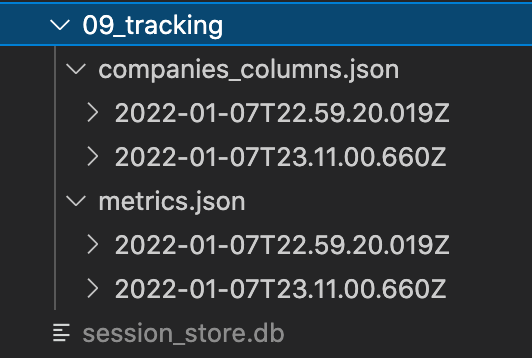
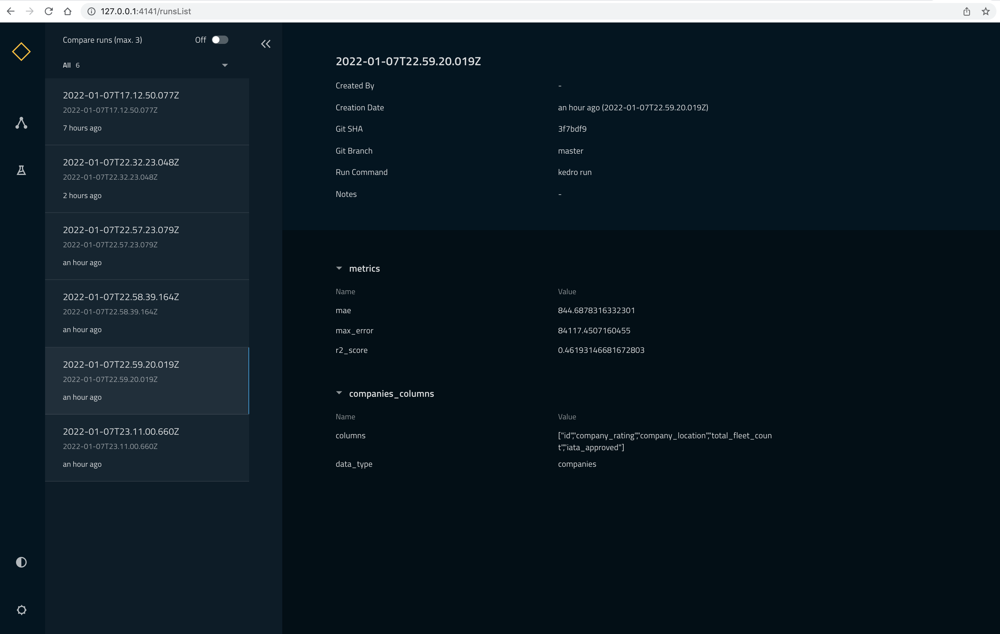

# Set up experiment tracking

Experiment tracking is the process of saving all machine-learning related experiment information so that it is easy to find and compare past runs.[Kedro-Viz](https://github.com/quantumblacklabs/kedro-viz) supports native experiment tracking from [version 4.1.0](https://github.com/quantumblacklabs/kedro-viz/releases/tag/v4.1.0) onwards. When experiment tracking is enabled in your Kedro project, you will be able to access, edit and compare your experiments directly from the Kedro-Viz web app. 

Enabling experiment tracking features on Kedro-Viz relies on [setting up a session store to capture experiment metadata](#set-up-session-store), [experiment tracking datasets to let Kedro know what metrics should be tracked](#set-up-tracking-datasets) and [modifying your nodes and pipelines to output those metrics](#setting-up-your-nodes-and-pipelines-to-log-metrics). 

This tutorial will provide a step by step process to set up experiment tracking and access your logged metrics from each run on Kedro-Viz, using the starter project Kedro-spaceflights as outlined in [this tutorial](../03_tutorial/01_spaceflights_tutorial.md). You can also jump directly to [this section](../03_tutorial/02_experiment_tracking.md) for direct reference in setting up experiment tracking for your Kedro project.

## Project setup

We assume that you have already [installed Kedro](../02_get_started/02_install.md) and [Kedro-Viz](../03_tutorial/06_visualise_pipeline.md). Now set up a new Kedro project using the Kedro-spaceflight starter by running

```bash
kedro new --starter=spaceflights
```

When prompted for a project name, enter `Kedro Experiment Tracking Tutorial`. Subsequently, accept the default suggestions for `repo_name` and `python_package` by pressing enter.

## Set up session store

In the domain of experiment tracking, each pipeline run is considered a session. A session store records all related metadata for each pipeline run, from logged metrics to other run-related data such as timestamp, git username and branch. The session store is a SQLite database that gets generated during your first Kedro run after it has been set up in your project.

To set up the session store, go to the `settings.py` file under `/src` and add the following:

```python
from kedro_viz.integrations.kedro.sqlite_store import SQLiteStore
from pathlib import Path
SESSION_STORE_CLASS = SQLiteStore
SESSION_STORE_ARGS = {"path": str(Path(__file__).parents[2] / "data")}
```

## Set up tracking datasets

There are two types of tracking datasets: [`tracking.MetricsDataSet`](/kedro.extras.datasets.tracking.MetricsDataSet) and [`tracking.JSONDataSet`](/kedro.extras.datasets.tracking.JSONDataSet). The `tracking.MetricsDataSet` should be used for tracking numerical metrics, and the `tracking.JSONDataSet` can be used for tracking any other JSON-compatible data like boolean or text-based data.

Let's set up the following 2 datasets to log our r2 scores and parameters for each run by adding the following in `catalog.yml` under `/conf/base`:

```yml
metrics:
type: tracking.MetricsDataSet
filepath: data/09_tracking/metrics.json

companies_columns:
  type: tracking.JSONDataSet
  filepath: data/09_tracking/companies_columns.json
```

## Setting up your nodes and pipelines to log metrics

Now that we have set up the tracked datasets to log our experiment tracking data, the next step is to ensure that the data is returned from your nodes.

Let's set up the data to be logged for the metrics dataset - under `nodes.py` of your `data_processing` pipeline (`/src/kedro-experiment-tracking-tutorial/pipelines/data_processing/nodes.py`), modify your `evaluate_model` function by adding in three different metrics: `score` to log your r2 score, `mae` to log your mean absolute error, and `me` to log your max error, and returning those 3 metrics as a key value pair.

The new `evaluate_model` function would look like this:

```python
def evaluate_model(
    regressor: LinearRegression, X_test: pd.DataFrame, y_test: pd.Series
) -> Dict[str, float]:
    """Calculates and logs the coefficient of determination.

    Args:
        regressor: Trained model.
        X_test: Testing data of independent features.
        y_test: Testing data for price.
    """
    y_pred = regressor.predict(X_test)
    score = r2_score(y_test, y_pred)
    mae = mean_absolute_error(y_test, y_pred)
    me = max_error(y_test, y_pred)
    logger = logging.getLogger(__name__)
    logger.info("Model has a coefficient R^2 of %.3f on test data.", score)
    return {"r2_score": score, "mae": mae, "max_error": me}
```

The next step is to ensure that the dataset is also specified as an output of your `evaluate_model` node. Under `pipeline.py` of your `data_processing` pipeline, specify the `output` of your `evaluate_model` to be the `metrics` dataset. Note that it is crucial that the output dataset exactly matches the name of the tracking dataset specified in the catalog file.

The node of the `evaluate_model` on the pipeline should look like this:

```python
node(
    func=evaluate_model,
    inputs=["regressor", "X_test", "y_test"],
    name="evaluate_model_node",
    outputs="metrics"
)
```

You have to repeat the same steps for setting up the `companies_column` dataset. For this dataset you should log the column that contains the list of companies as outlined in `companies.csv` under `/data/01_raw`. Modify the `preprocess_companies` function under the `data_processing` pipeline to return the data under a key value pair, as shown below:

```python
def preprocess_companies(companies: pd.DataFrame) -> pd.DataFrame:
    """Preprocesses the data for companies.

    Args:
        companies: Raw data.
    Returns:
        Preprocessed data, with `company_rating` converted to a float and
        `iata_approved` converted to boolean.
    """
    companies["iata_approved"] = _is_true(companies["iata_approved"])
    companies["company_rating"] = _parse_percentage(companies["company_rating"])
    return companies, {"columns": companies.columns.tolist(), "data_type": "companies"}
```

Again, you will need to ensure that the dataset is also specified as an output on `pipeline.py` under the `data_processing` pipeline, as follows:

```python
node(
    func=preprocess_companies,
    inputs="companies",
    outputs=["preprocessed_companies", "companies_columns"],
    name="preprocess_companies_node",
)
```

Having set up both datasets, you are now ready to generate your first set of experiment tracking data!

## Generating Run data

One of the beauty of native experiment tracking in Kedro is that all tracked data are generated and stored each time you do a Kedro run. Hence, to generat the data, simply do:

```bash
Kedro run
```

After the run completes, under `data/09_tracking`, you will now see 2 folders, `companies_column.json` and `metrics.json`. On performing a Kedro run after setting up the tracking datasets, Kedro will generate a folder under the dataset name for each tracked dataset, with each folder containing another folder named under the timestamp of the run. Each subsequent Kedro run will generate a new folder named after the timestamp of the run, in the same directory of the tracked dataset.

You will also see the `session_store.db` generated from your first Kedro run after enabling experiment tracking, which is used to store all the generated run metadata, alongside the tracking dataset, to be used for exposing experiment tracking to Kedro-Viz.



Try to execute `Kedro run` a few times to generate a larger set of experiment data. You can also play around with setting up different tracking datasets, and check the logged data via the generated JSON data files.

## Accessing Run data and comparing runs on Kedro-Viz

Here comes the fun part of accessing your run data on Kedro-Viz. Having ensured that you are using Kedro-Viz `>=4.1.1` (you can confirm your Kedro-Viz version by running `Kedro info`), run

```bash
kedro viz
```

On spinning up Kedro-Viz, you will now see an `experiment tracking` icon on your left. Clicking the icon will bring you to the experiment tracking page (you can also access the page via `http://127.0.0.1:4141/runsList`), where you will now see the set of experiment data generated from your previous Kedro runs, as shown below:



You will now be able to access, compare and pin your runs by toggling the `Compare runs` button, as shown below:


You can also access a more detailed demo [here](https://kedro-viz-live-demo.hfa4c8ufrmn4u.eu-west-2.cs.amazonlightsail.com/).

s

## Feedback

The Kedro team is constantly working on improving our product, and would love your feedback to help evolve this feature - please reach out to us with any comments or questions via our Discord channel or by via Github issues. (https://github.com/quantumblacklabs/kedro/issues). 

Happy Tracking! :test_tube: